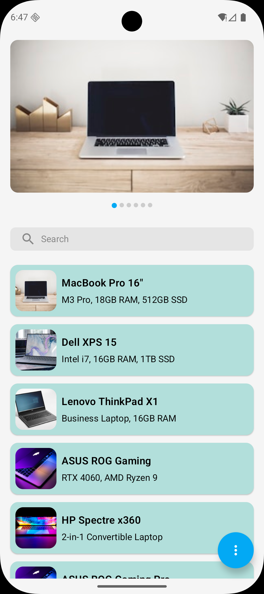
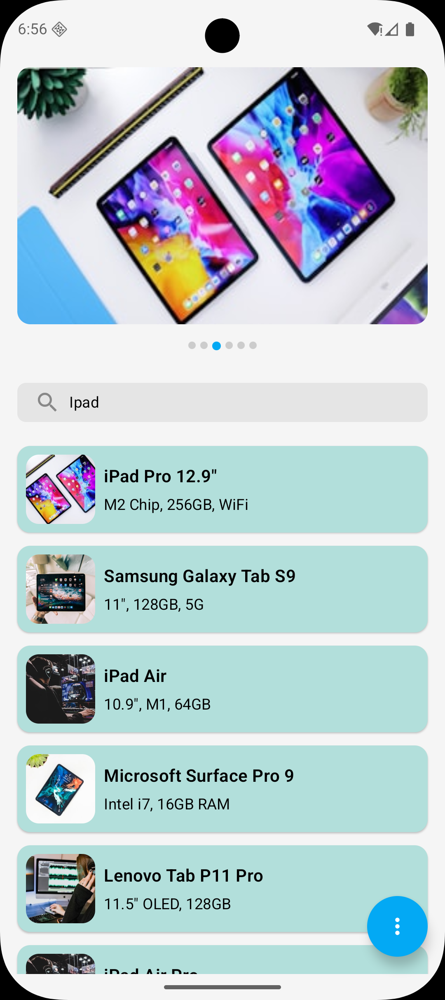

# Image Carousel & Search App

A technical assessment project implementing an image carousel with synchronized list, sticky search, and statistics - built with both **Jetpack Compose** and **XML**.

## Requirements
- Swipeable image carousel synced with content list
- Sticky search bar with real-time filtering
- Statistics bottom sheet (item count + top 3 characters)
- No third-party libraries
- Dual implementation: Compose (feature/compose_productlist) & XML (feature/xml_productlist)

## Screenshots

| Carousel & List           | Search Active               | Statistics                 |
|---------------------------|-----------------------------|----------------------------|
|  |  |  |

## Architecture

**Pattern:** MVVM + Repository
```
UI Layer (Compose/XML)
    ↓
ViewModel (StateFlow)
    ↓
Repository (Data Provider)
    ↓
Data Sources (Local Database Room)
```

### Key Components

**ViewModel** - State management, search debouncing, statistics calculation  
**Repository** - Data abstraction layer  
**StateFlow** - Reactive state updates to UI

### Data Flow Example
```
User swipes carousel
  → Page change event
  → ViewModel updates currentPage
  → StateFlow emits new state
  → UI updates list content
```


## Tech Stack

- **Language:** Kotlin
- **UI:** Jetpack Compose + Material3 / XML + ViewBinding
- **Architecture:** MVVM, Repository Pattern
- **DI:** Koin
- **Reactive:** Coroutines, Flow, StateFlow
- **Components:** ViewPager2, LazyColumn, BottomSheet

## Future Improvements
### Multimodule Architecture
```
:app                     # Application module
:feature:products        # Products list (Search, Stats, Carousel)
:feature:product-details # Product Details screen
: .. etc
:core:data               # Repository & models
:core:domain             # UseCases & business logic
:core:ui                 # Shared UI components
:core:database           # Local Db Setup
:core:common             # Utils, such as CustomImageLoader, Enums and etc.
```

### Extended Features
- **Clean Architecture** - Add domain layer with UseCases
- **Remote Data** - Retrofit + Room for network/cache
- **Offline-First** - WorkManager for background sync
- **Testing** - Unit tests, UI tests, Screenshot tests
- **Performance** - Image caching, pagination, memory optimization

### Architecture Evolution
```
Current: UI → ViewModel → Repository → Data

Future:  UI → ViewModel → UseCase → Repository → DataSource
         ↑                   ↑           ↑
       State            Business       Cache/API
                          Logic
```

## How to Run
```bash
# Compose version
git checkout feature/compose_productlist
./gradlew installDebug

# XML version
git checkout  feature/xml_productlist
./gradlew installDebug
```

**Author:** Sulton
